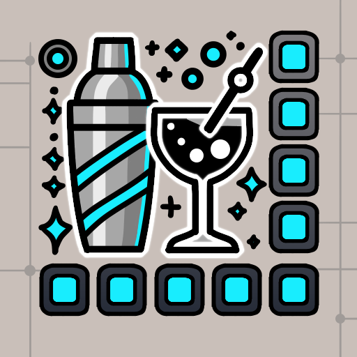

#  Bartender

Bartender is a FFXIV plugin which allows you to save and load your hotbars, mimicking vanilla's `/hotbar copy` command.

This implementation allows you to have virtually an infinite number of hotbar configurations (profiles).

Please create an [issue](https://github.com/AtaeKurri/Bartender/issues/new) if you find any bugs or want to see a new feature.

## Features

* A GUI to save/load hotbar profiles.
* `/barload <profile name>` is used to load (and populate) one or multiple hotbars with the saved icons.
* `/barclear <profile name>` clears the bars used by the profile of any icons.

## Planned features

* **Gearsets** : Load a profile of a gear set change. (TODO: Rajouter une option dans le contextmenu pour lier un gearset à un
profile)

## Usage

**Basic usage goes as so:**
-> Create a new profile.
-> Fill your bars with actions.
-> Click `Save current hotbars`.
-> Check the hotbars you want to use/load.

You can then load your profile using the `/barload <profile name>` command inside the chat or in a macro.
